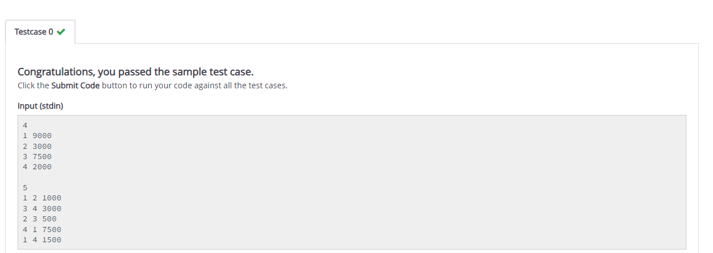
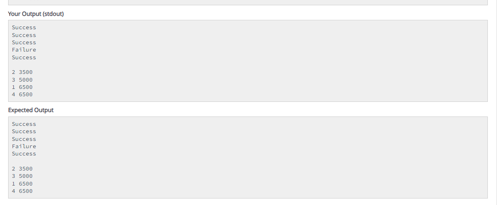

# Digital-Wallet-Management-System

## Introduction
The Digital Wallet Management System is a software platform designed to facilitate digital financial transactions. It enables users to manage their accounts by transferring and receiving funds securely and conveniently, while also providing a view of their account balances. This system is aimed at simplifying financial management by ensuring that transactions are handled efficiently and that users' balances are accurately maintained.

## Description
This system manages multiple users, each with a unique ID and an initial balance. It processes a series of transactions between users, validating and updating balances as required. The system ensures that transactions are executed correctly and provides feedback on the success or failure of each transaction. After processing all transactions, users are sorted by their remaining balance, and the results are displayed.

## Key Features:
1.User Initialization: Users are initialized with unique IDs and specified initial balances.
2.Transaction Processing: The system manages fund transfers between users, ensuring that transactions are only completed if the sender has sufficient balance.
3.Sorting and Display: After transactions, users are sorted by their remaining balance in descending order, with ties broken by user IDs in ascending order.

## Explanation
This project is a straightforward implementation of a digital wallet system where user data is managed and transactions are processed. The system uses basic data structures to store user information and performs operations on this data to simulate real-world financial transactions.

### Components:
1.Users: Each user has a unique userID and an associated balance.
2.Transactions: These involve a transfer of funds from one user to another and are validated based on the sender’s balance.
3.Sorting: Users are sorted by their remaining balance after all transactions, providing a clear view of their financial standings.

### Calculation Logic:
1.Input Parsing: The system first reads the number of users and their respective balances, followed by the number of transactions and their details.
2.Transaction Execution: For each transaction, the system checks if the sender has enough balance to complete the transaction. If so, the transaction proceeds, and balances are updated. If not, the transaction fails.
3.Sorting: Once all transactions are processed, users are sorted by their balance in descending order. If two users have the same balance, they are sorted by their userID in ascending order.
4.Output: The system outputs the result of each transaction (success or failure) and the final sorted list of users and their balances.

## Conclusion
The Digital Wallet Management System is a basic yet effective implementation of a transaction processing system. It highlights essential functionalities such as user management, transaction validation, and sorting. While simple, this system serves as a foundational model that can be expanded to include more complex features such as transaction history, error handling, and security measures, making it suitable for more extensive digital financial management applications.

## Output

